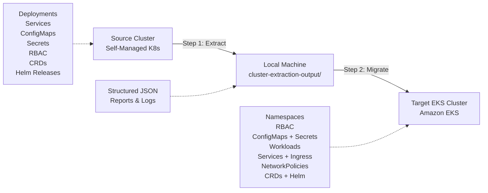

## Migrating a Large-Scale Enterprise-Grade Self-Managed Kubernetes Cluster to Amazon EKS

End-to-end toolkit for extracting resources from a self-managed Kubernetes cluster and migrating them to Amazon EKS in controlled, validated phases.

## How It Works



**Migration Flow:**
1. **Extract** → Pull all resources from source cluster into structured JSON
2. **Transform** → Process and adapt resources for EKS compatibility  
3. **Migrate** → Deploy resources to target EKS cluster with validation

---

## Project Structure

```
.
├── README.md
├── extraction/
│   └── extract_cluster_info.py   # Extracts all resources from the source cluster
└── migration/
    └── migrate_to_eks.py         # Migrates extracted resources to the target EKS cluster
```

### Generated at Runtime

```
cluster-extraction-output/        # Created by the extraction script
├── SUMMARY.json
├── cluster/
│   ├── version.json
│   ├── nodes.json
│   └── namespaces.json
├── workloads/{namespace}/
│   ├── deployments.json
│   ├── statefulsets.json
│   ├── daemonsets.json
│   ├── jobs.json
│   └── cronjobs.json
├── networking/{namespace}/
│   ├── services.json
│   ├── ingresses.json
│   └── networkpolicies.json
├── storage/
│   ├── storageclasses.json
│   ├── persistentvolumes.json
│   └── {namespace}/pvcs.json
├── config/{namespace}/
│   ├── configmaps.json
│   └── secrets_metadata.json
├── rbac/
│   ├── clusterroles.json
│   ├── clusterrolebindings.json
│   ├── roles.json
│   ├── rolebindings.json
│   └── serviceaccounts.json
├── crds/
│   ├── crd_list.json
│   └── instances/{crd_name}.json
├── helm/
│   └── releases.json
└── policies/{namespace}/
    ├── resourcequotas.json
    └── limitranges.json

migration-output/                # Created by the migration script
├── dry-run/
│   ├── migration_report.json
│   └── migration.log
└── live/
    ├── migration_report.json
    └── migration.log                 


```

---

## Prerequisites

| Requirement | Details |
|---|---|
| Python | 3.9+ |
| kubectl | Configured with access to the source cluster (extraction) and target EKS cluster (migration) |
| AWS CLI | Configured with permissions for EKS, IAM, EC2 (migration) |
| Helm (optional) | Required only if migrating Helm releases |
| Target EKS Cluster | Must already exist — the migration script does **not** create the cluster |

### Target EKS Cluster Recommendations

Before running the migration, ensure the following are installed on the EKS cluster:

- **Amazon EBS CSI Driver** — for StorageClass provisioner remapping (`ebs.csi.aws.com`)
- **AWS Load Balancer Controller** — for Service type `LoadBalancer` and ALB Ingress
- **Any CRD operators** — controllers for custom resources used in the source cluster (e.g., cert-manager, Prometheus Operator)

---

## Step 1 — Extract from Source Cluster

Point `kubectl` at the **source** self-managed cluster and run:

```bash
cd extraction/
python extract_cluster_info.py
```

### What It Extracts (10 Steps)

| Step | Resources | Output Path |
|---|---|---|
| 1 | Kubernetes version, node info (capacity, labels, taints, runtime) | `cluster/` |
| 2 | Namespaces (excludes kube-system, kube-public, kube-node-lease) | `cluster/` |
| 3 | Deployments, StatefulSets, DaemonSets, Jobs, CronJobs | `workloads/{ns}/` |
| 4 | Services, Ingresses, NetworkPolicies | `networking/{ns}/` |
| 5 | StorageClasses, PersistentVolumes, PVCs | `storage/` |
| 6 | ConfigMap data (full key-value pairs), Secret metadata (no secret values exported) | `config/{ns}/` |
| 7 | ClusterRoles, ClusterRoleBindings, Roles, RoleBindings, ServiceAccounts | `rbac/` |
| 8 | Custom Resource Definitions and their instances | `crds/` |
| 9 | Helm release metadata (name, namespace, version, status) | `helm/` |
| 10 | ResourceQuotas, LimitRanges | `policies/{ns}/` |

All output is written to `cluster-extraction-output/` as structured JSON.

---

## Step 2 — Migrate to Amazon EKS

Switch `kubectl` context to the **target EKS cluster** and run:

```bash
cd migration/

# Dry run — preview all phases without applying anything
python3 migrate_to_eks.py --dry-run

# Full migration
python migrate_to_eks.py --extraction-dir ../extraction/cluster-extraction-output

# Resume from a specific phase (e.g., after fixing errors in phase 3)
python migrate_to_eks.py --start-phase 4 --extraction-dir ../extraction/cluster-extraction-output
```

### CLI Options

| Flag | Default | Description |
|---|---|---|
| `--dry-run` | `false` | Preview mode — logs what would happen without applying |
| `--start-phase` | `1` | Resume migration from phase N (1–8) |
| `--extraction-dir` | `cluster-extraction-output` | Path to the extraction output directory |

### Migration Phases & Validation

The migration runs in 8 sequential phases. Each phase applies resources and validates the result before proceeding. On errors, the script prompts whether to continue or abort.

| Phase | What It Does | Validation |
|---|---|---|
| **1. Namespaces** | Creates all non-system namespaces | Confirms each namespace exists on target |
| **2. RBAC** | Migrates ServiceAccounts, ClusterRoles, ClusterRoleBindings, Roles, RoleBindings. Skips system/EKS built-in roles (`system:*`, `eks:*`, `cluster-admin`, etc.) | Spot-checks migrated resources exist |
| **3. Storage Classes** | Applies StorageClasses with automatic provisioner remapping (e.g., `kubernetes.io/aws-ebs` → `ebs.csi.aws.com`). Skips EKS defaults (`gp2`) | Verifies each StorageClass exists on target |
| **4. ConfigMaps & Secrets** | Migrates ConfigMaps with actual data from the source cluster. Creates Secrets as Opaque placeholders (values must be populated post-migration). Skips SA token secrets | Verifies each resource exists on target |
| **5. CRDs** | Applies Custom Resource instances. Warns if the CRD/operator is not installed on target | Checks CRD registration on target cluster |
| **6. Workloads** | Rebuilds Deployments, StatefulSets, DaemonSets, Jobs, CronJobs from extracted specs (images, resources, env, command, args, volumes, affinity, tolerations) | Waits for Deployment rollout status (`kubectl rollout status`) |
| **7. Services & Ingress** | Migrates Services (strips `clusterIP`, adds AWS LB Controller annotations for `LoadBalancer` type), Ingresses (sets ALB ingress class), NetworkPolicies | Waits for Service endpoints to populate |
| **8. Helm Releases** | Detects Helm releases and generates re-install commands (requires original chart source) | Logs actionable `helm install` commands |

---

## Key Design Decisions

### Metadata Sanitization
Both scripts strip cluster-specific fields (`resourceVersion`, `uid`, `creationTimestamp`, `managedFields`, `last-applied-configuration`) before applying to the target cluster to avoid conflicts.

### Secret Safety
The extraction script captures only secret **metadata** (name, type, key names) — never the actual values. The migration script creates placeholder secrets. Actual secret values should be migrated via:
- **AWS Secrets Manager**
- **AWS Systems Manager Parameter Store**
- **External Secrets Operator**

### Storage Provisioner Remapping
The migration script automatically remaps legacy in-tree provisioners to the EKS-compatible CSI drivers:

| Source Provisioner | Target Provisioner |
|---|---|
| `kubernetes.io/aws-ebs` | `ebs.csi.aws.com` |
| `kubernetes.io/gce-pd` | `ebs.csi.aws.com` |
| `kubernetes.io/no-provisioner` | `kubernetes.io/no-provisioner` (unchanged) |

### Networking Adaptations
- **Services**: `clusterIP` and `clusterIPs` are removed so EKS assigns new IPs. `LoadBalancer` services get AWS LB Controller annotations.
- **Ingresses**: Default to `alb` ingress class with `internet-facing` scheme if not already set.

### System Resource Filtering
The following are automatically skipped to avoid conflicts with EKS-managed resources:
- Namespaces: `default`, `kube-system`, `kube-public`, `kube-node-lease`
- ClusterRoles/Bindings: `system:*`, `eks:*`, `aws-node`, `vpc-resource-controller`, `admin`, `edit`, `view`, `cluster-admin`
- ServiceAccounts: `default` in system namespaces
- Secrets: `kubernetes.io/service-account-token` type

---

## Migration Report

After migration, a detailed JSON report is saved to `migration-output/live/migration_report.json` (or `migration-output/dry-run/migration_report.json` for dry runs):

```json
{
  "phases": [
    {
      "phase": "1-namespaces",
      "status": "completed",
      "migrated_count": 12,
      "skipped_count": 4,
      "error_count": 0,
      "migrated": ["app-prod", "app-staging", "..."],
      "skipped": ["default", "kube-system", "..."],
      "errors": []
    }
  ],
  "dry_run": false
}
```

A full log is also written to `migration-output/live/migration.log`.

---

## Recommended Migration Workflow

```
┌─────────────────────────────────────────────────────────┐
│  1. EXTRACT from source cluster                         │
│     kubectl config use-context source-cluster           │
│     python extraction/extract_cluster_info.py           │
├─────────────────────────────────────────────────────────┤
│  2. REVIEW extracted data                               │
│     Inspect cluster-extraction-output/SUMMARY.json      │
│     Verify node specs, workload counts, storage needs   │
├─────────────────────────────────────────────────────────┤
│  3. PREPARE target EKS cluster                          │
│     Install EBS CSI Driver, AWS LB Controller           │
│     Install CRD operators (cert-manager, etc.)          │
│     Configure IAM roles for service accounts (IRSA)     │
├─────────────────────────────────────────────────────────┤
│  4. DRY RUN migration                                   │
│     kubectl config use-context eks-cluster              │
│     python migration/migrate_to_eks.py --dry-run        │
├─────────────────────────────────────────────────────────┤
│  5. MIGRATE                                             │
│     python migration/migrate_to_eks.py                  │
│     Review migration-output/migration_report.json       │
├─────────────────────────────────────────────────────────┤
│  6. POST-MIGRATION                                      │
│     Populate real secret values (Secrets Manager / SSM) │
│     Re-install Helm releases from chart sources         │
│     Update DNS / external traffic routing               │
│     Validate application health and connectivity        │
└─────────────────────────────────────────────────────────┘
```

---

## Limitations & Manual Steps

- **Persistent Volume data** is not migrated — use [AWS DataSync](https://aws.amazon.com/datasync/) or [Velero](https://velero.io/) for PV data migration.
- **Helm releases** require the original chart source to re-install — the script outputs the commands but cannot execute them without chart references.
- **Secret values** are created as placeholders — populate them manually or via automation post-migration.
- **CRD operators/controllers** must be installed on the target EKS cluster before migrating CR instances.
- **Image registries** — if the source cluster uses a private registry, ensure EKS nodes have pull access (ECR, image pull secrets, etc.).

---


## Rollback / Cleanup Migrated Resources from EKS

Use the rollback script to automatically remove everything the migration created,
in the correct reverse order (networking → workloads → CRDs → config → storage → RBAC → namespaces).

```bash
# Switch kubectl to target EKS
aws eks update-kubeconfig --name my-eks-cluster --region us-west-2

cd ../migration

# Preview what will be deleted (safe, no changes)
python3 rollback_eks_migration.py --dry-run

# Actually rollback (will ask for confirmation)
python3 rollback_eks_migration.py

# Skip confirmation prompt
python3 rollback_eks_migration.py --yes

# Use a custom report path
python3 rollback_eks_migration.py --report migration-output/live/migration_report.json
```

The script reads the migration report (`migration_report.json`) to know exactly
which resources were migrated, so it only deletes what was created.

A `rollback_report.json` is saved alongside the migration report with full details.

---

## License

This project is provided as a reference implementation for blog purposes. Use at your own risk in production environments. We recommend testing in a staging EKS cluster first.


## Security

See [CONTRIBUTING](CONTRIBUTING.md#security-issue-notifications) for more information.

## License

This library is licensed under the MIT-0 License. See the LICENSE file.

